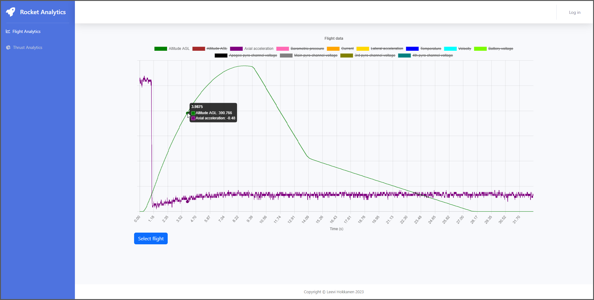
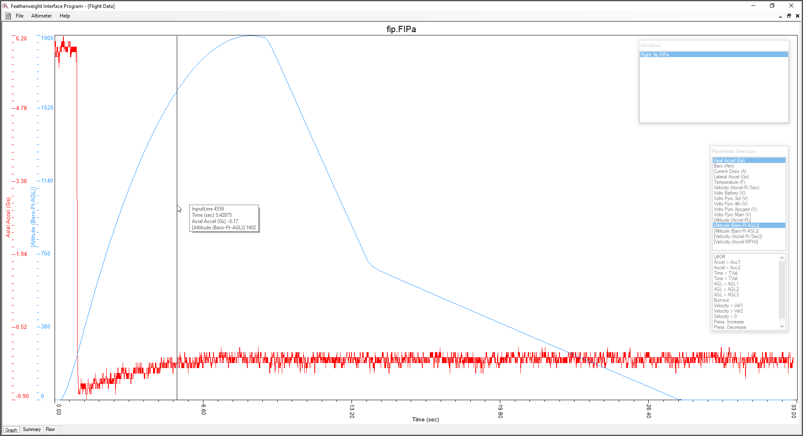

# Rocket Analytics

Rocket Analytics is a website for visualizing data from model rocket flights
and motor tests. It is a hobby project, and the goal is to learn new tools and
technologies for web development. This time those tools and technologies are
automated deployment and React.

Ideally, this tool would be a desktop application. But since the goal is to
learn web development, that is not an option. From an end-user perspective,
there are mainly two downsides to this approach. First, as a website, it
requires a webserver running somewhere, which means running costs. And while I
do attempt to automate the cloud configuration and deployment, this is unlikely
to be a good solution for people who are not into software development. But
this project might be a good starting point if you like to do things yourself.

> **Note**  
> The project is in the early development stage. Many features are missing, and
> existing features may be incomplete. Since there are currently no releases,
> all software is in the development branch.

 

## Why am I doing this project?

Besides learning new skills, this project will also have a practical use for
me. You see, I design and build model rockets. Those rockets fly up into the
air and land softly with a parachute (hopefully). And since I am an engineer, I
want data from those flights. The way to do that is to use an altimeter, which
goes into the rocket and measures a bunch of data during the flight (altitude,
acceleration, etc.). After the flight, the data can be loaded from the
altimeter and visualized with software. And the altimeter that I use comes with
a desktop application to do the data visualization.

But here comes the problem. The altimeter uses imperial units because it
targets US markets. But the imperium does not reach where I live, so I use
metric units. And the software does not even offer unit conversion, so that's a
big negative. There is also the problem of having no color coding between the
values on the tooltip and the lines on the chart. And if you have multiple
datasets visible at the same time, there will be way too many y-axes to make
any use of them. So do I already have enough excuses to make my own software?

 

## What can you do with the website?

There are two main features that I am planning to implement, Flight Analytics
and Thrust Analytics. Flight Analytics plots the data from the altimeter, which
can be helpful for a few things. If you are interested in altitude and want to
go higher and higher, it is easy to see how this data is beneficial. But this
data could also be helpful if something unexpected happens during the flight or
help notice something unexpected. Thrust Analytics, on the other hand, focuses
on visualizing data from static fire tests and is helpful if you are testing
new motors or want to characterize motors.

## How does the website work behind the scenes?

### Backend

Let's approach the backend by thinking about how a request would travel through
it and get turned into a response that gets back to the client. The first layer
is the outward-facing web server, which will likely end up being NGINX. If the
request is for static files, NGINX will handle the request entirely and send
the files back as a response. On the other hand, if the request is for the API,
NGINX will act as a proxy and forward the request to the actual application
server.

The second layer is the application server, which is Uvicorn. Uvicorn's
responsibility is to run the web application and forward the requests to it.
Uvicorn could also perform load balancing with multiple processes, but that is
not feasible in this case. The website will run with minimal hardware, so there
won't be enough resources to take advantage of multiple processes.

The web application is the third layer, and it is a REST API. The API is
implemented with Python, and it uses FastAPI. Once FastAPI receives the
request, it will look for a matching endpoint. Then, FastAPI will validate the
request data according to the API schema if the endpoint exists. After
successful validation, the endpoint receives the data. Finally, the endpoint
contains some custom logic, and most endpoints will access the database.

Database access happens through ORM, which forms the fourth layer. ORM allows
the application to handle the database in the native language, so SQL is not
mandatory. In practice, this allows defining the database as an object. And the
developer can use the same object to query data from the database. Finally, the
ORM will handle the SQL queries and construct the response object.

The database is the fifth and final layer. There are many relational databases,
but PostgreSQL is my default choice. It handles data storage and retrieval, as
well as ensures data integrity. Currently, the website works with a fixed data
structure, so relational databases are a good choice. But in the future, if the
website needs to support different altimeters, the data structure needs to be
flexible. So at that point, the database will likely change to something NoSQL.

Now that the request has traveled all the way to the bottom, it will begin to
make its way back toward the client. The endpoint will receive the data and
pass everything to the FastAPI, which will perform validation according to the
API schema. The schema controls what data is sent back to the client and
prevents sending extra data by accident, like passwords. Finally, FastAPI turns
the data into JSON response and hands it over to the application server, from
where it goes to the NGINX and back to the client.

### Frontend

The frontend is created with React, using a few third-party libraries and
frameworks to make life a little easier. Bootstrap is the most heavily utilized
framework, as it is the foundation for almost all components. And whether you
hate or love it, it allows focusing on relevant things instead of fiddling with
paddings and margins. The site also uses React Router, which allows one to
create pages and navigate between them as a single-page application. And
finally, there is Chart.js for doing all the heavy lifting related to styling
and plotting the data.

Regarding application logic, let's look at how data flows within the frontend
using Flight Analytics as an example. When the Flight Analytics page opens, the
frontend makes an API call to retrieve metadata from all flights. This data
lets the frontend to create a list of all flights so the user can select which
flight data to display. When the user selects a specific flight, the frontend
fetches the actual data for that flight from the API. The data is then stored
locally to avoid requesting it repeatedly, making the site faster. Finally, the
selected flight data is stored in a state and passed to Chart.js for plotting.
